# Production-Ready Jenkins on Amazon EKS: Comprehensive Deployment Guide

This guide provides an enhanced, step-by-step walkthrough for deploying a highly available, scalable, and secure Jenkins cluster on Amazon EKS. It includes 1 controller statefulset replicas for redundancy, Amazon EFS for persistent shared storage, dynamic Kubernetes agents for polyglot builds (Java, Python, Node.js), Configuration as Code (JCasC) for automation, NGINX Ingress for secure access, and Horizontal Pod Autoscaler (HPA) for dynamic scaling. Emphasizing production readiness, this setup supports zero-downtime upgrades, automated backups, advanced monitoring, and cost optimization to handle enterprise workloads efficiently.

The architecture diagram illustrates the setup with color-coded components (e.g., orange for controllers, green for agents, pink for storage).

***This Jenkins setup is designed for small organizations with a light workload, utilizing the open-source version of Jenkins and it's support a single master node within the Jenkins cluster.***

## 🧰 Architecture Overview

This project utilizes the official Jenkins Helm chart to establish a resilient CI/CD platform on Kubernetes, seamlessly integrated with AWS services for persistence, scaling, and security.

> *High-Availability CI/CD Pipeline on EKS*

Key components include:

- **Jenkins Controllers**: Multiple replicas distributed across availability zones for fault tolerance.
- **Agents**: On-demand pods with labels for language-specific builds, ensuring efficient resource allocation.
- **Storage**: EFS for shared, encrypted persistence to prevent data loss.
- **Networking**: NGINX Ingress with TLS for secure, domain-based external access.
- **Scaling**: HPA and Cluster Autoscaler for automatic adjustments based on workload demands.


## 📋 Prerequisites

Ensure these are prepared to avoid deployment issues in a production environment:

- An active Amazon EKS cluster (version 1.28 or later for enhanced security features and stability).
- `kubectl` (v1.28+) and `helm` (v3.12+) installed, with proper cluster authentication.
- An Amazon EFS filesystem in the same VPC as EKS, configured with mount targets in all subnets and encryption enabled.
- NGINX Ingress Controller deployed (version 1.9+ recommended) with external traffic policy set to Local for better performance.
- DNS record (e.g., `jenkins-prod.example.com`) configured via Route 53 or equivalent, pointing to the Ingress load balancer.
- A Git repository for shared libraries (e.g., `https://github.com/your-org/jenkins-shared-lib.git`), with branch protection enabled.
- AWS IAM roles with policies for EKS nodes to access EFS, Secrets Manager, and other services.
- Optional: AWS Certificate Manager (ACM) for automated TLS certificates and Prometheus for monitoring.


## 🛡️ Best Practices for Production-Ready Jenkins Cluster

Drawing from AWS Well-Architected Framework and Jenkins best practices, implement these to achieve reliability, security, and operational excellence:

- **High Availability**: Deploy at least 4 replicas across multiple AZs; use anti-affinity rules to spread pods and avoid correlated failures.
- **Security**: Leverage JCasC for immutable configurations, integrate with AWS Secrets Manager for credential rotation, enable Webhook authentication, and scan container images with tools like Trivy.
- **Scaling and Performance**: Configure HPA with custom metrics (e.g., queue length) and use AWS Node Termination Handler for graceful shutdowns. Optimize agents with pod templates to match workload needs.
- **Monitoring and Logging**: Enable Jenkins metrics endpoint and integrate with Prometheus/Grafana for dashboards; forward logs to Amazon CloudWatch or ELK stack with alerting on anomalies like build failures or high latency.
- **Backups and Disaster Recovery**: Automate daily EFS snapshots using AWS Backup with retention policies; implement Jenkins Configuration Backup plugin and store in S3 with versioning. Conduct regular DR drills.
- **Upgrades and Maintenance**: Use blue-green deployments for Helm upgrades; automate testing with Jenkins pipelines and monitor deprecations via Jenkins Update Center.
- **Cost Optimization**: Utilize AWS Savings Plans for EKS, configure agent timeouts to 30 minutes, and use Kubernetes resource quotas to prevent over-provisioning.
- **Compliance and Auditing**: Enable Jenkins audit logging to S3, enforce two-factor authentication, and align with standards like SOC 2 by restricting access via network policies.

Adopting these practices minimizes downtime, reduces costs, and ensures compliance in production.


## 🛠️ Step-by-Step Installation Guide

### 🔧 Step 1: Install Amazon EFS CSI Driver

Install the driver to enable dynamic EFS mounting:

```
kubectl apply -k "github.com/kubernetes-sigs/aws-efs-csi-driver/deploy/kubernetes/overlays/stable/ecr/?ref=release-1.7"
```

Verify:

```
kubectl get pods -n kube-system -l app=efs-csi-controller
```

*Production Tip*: Enable driver logging to CloudWatch for troubleshooting persistent volume issues.

### 💾 Step 2: Create EFS PersistentVolume and PersistentVolumeClaim

Use `efs-volume-mount.yaml` for shared storage.

**File: efs-volume-mount.yaml** (customize with your EFS ID):


Apply:

```
kubectl create namespace jenkins
kubectl apply -f efs-volume-mount.yaml
```

*Production Tip*: Set up EFS access points for isolated directories and enable automatic scaling policies.

### ⚙️ Step 3: Prepare Helm values.yaml

Customize for production with `values.yaml`.

**File: values.yaml** (example with enhancements):

```yaml
controller:
  replicaCount: 4
  image:
    tag: "2.452.2-lts"
  persistence:
    existingClaim: jenkins-efs-pvc
  JCasC:
    enabled: true
    configScripts:
      # Define security realms, agent templates, etc.
  installPlugins:
    - kubernetes:1.31.0
    - configuration-as-code:1.55.0
    # Add security and monitoring plugins
  resources:
    requests:
      cpu: "1"
      memory: "2Gi"
  metrics:
    enabled: true
  podSecurityContext: {}  # Add for compliance
```

*Production Tip*: Use Helm secrets plugin to encrypt sensitive values.

### 🚀 Step 4: Deploy Jenkins with Helm

```
helm repo add jenkinsci https://charts.jenkins.io
helm repo update
helm upgrade --install jenkins jenkinsci/jenkins --namespace jenkins --values values.yaml
```

Monitor:

```
kubectl get pods -n jenkins -w
```

*Production Tip*: Add `--dry-run` first to validate configurations.

### 🌐 Step 5: Configure Ingress for External Access

**File: ingress.yaml** (with TLS):

```yaml
apiVersion: networking.k8s.io/v1
kind: Ingress
metadata:
  name: jenkins-ingress
  namespace: jenkins
  annotations:
    nginx.ingress.kubernetes.io/rewrite-target: /
    nginx.ingress.kubernetes.io/ssl-redirect: "true"
    cert-manager.io/cluster-issuer: "letsencrypt-prod"
spec:
  tls:
    - hosts:
        - jenkins-prod.example.com
      secretName: jenkins-tls-secret
  rules:
    - host: jenkins-prod.example.com
      http:
        paths:
          - path: /
            pathType: Prefix
            backend:
              service:
                name: jenkins
                port:
                  number: 8080
```

Apply:

```
kubectl apply -f ingress.yaml
```

*Production Tip*: Implement rate limiting annotations to prevent DDoS attacks.

### 📈 Step 6: Enable Horizontal Pod Autoscaler (HPA)

**Note**: This will not help for single node cluster

**File: hpa.yaml**:

```yaml
apiVersion: autoscaling/v2
kind: HorizontalPodAutoscaler
metadata:
  name: jenkins-hpa
  namespace: jenkins
spec:
  scaleTargetRef:
    apiVersion: apps/v1
    kind: Deployment
    name: jenkins
  minReplicas: 4
  maxReplicas: 8
  metrics:
    - type: Resource
      resource:
        name: cpu
        target:
          type: Utilization
          averageUtilization: 70
    - type: Resource
      resource:
        name: memory
        target:
          type: Utilization
          averageUtilization: 80
```

Apply:

```
kubectl apply -f hpa.yaml
```

*Production Tip*: Integrate with KEDA for event-driven scaling based on Jenkins queue metrics.

### 🔑 Step 7: Access and Verify Jenkins

- Password: `kubectl exec -it jenkins-0 -n jenkins -- cat /run/secrets/chart-admin-password`.
- Access: `https://jenkins-prod.example.com`.
- Verify: Test agents and pipelines in the UI.

*Production Tip*: Set up SSO with AWS Cognito for secure access.

### 📚 Step 8: Configure Shared Library and Pipelines

- Add credentials securely via JCasC.
- Create pipelines leveraging shared libraries for standardized builds.

*Production Tip*: Use pipeline scanning tools like Checkmarx for security in CI/CD.

### 🛡️ Step 9: Monitoring, Backups, and Maintenance

- **Monitoring**: Deploy Prometheus and set up Grafana dashboards for real-time insights.
- **Backups**: Configure AWS Backup with cross-region replication.
- **Upgrades**: Use Helm hooks for pre/post-upgrade scripts.
- **Cleanup**: Implement disk-usage plugin with automated pruning.

*Production Tip*: Schedule maintenance windows and notify teams via Slack integrations.

This enhanced guide ensures a robust, production-optimized Jenkins deployment. For issues, inspect logs with `kubectl logs <pod-name> -n jenkins` and consult AWS/Jenkins documentation.

***If you have havy workload please checkitout [cloudbees Jenkins](https://docs.cloudbees.com/docs/cloudbees-ci/latest/eks-install-guide/installing-eks-using-helm)***
